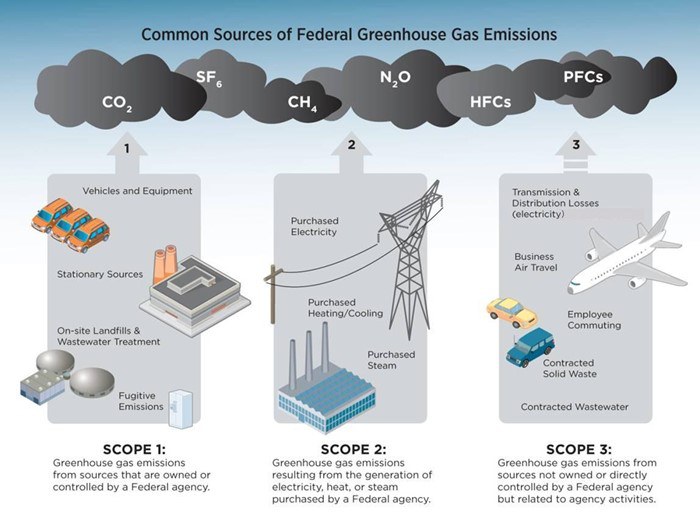

# Carbon Plans

Organizations are publishing carbon plans that outline current carbon emissions, future carbon emission targets, and changes they will implement to reach the future targets.

This section starts with definitions of the terms these carbon plans use.

# CO2 Equivalent Emissions

Carbon dioxide is the main greenhouse gas but other gasses are emitted as well that trap radiant heat in the atmosphere.
These other gasses have their heat trapping compared to carbon dioxide and are expressed in terms of the equivalent amount of CO2 that would trap an equivalent amount of heat.
This is called the CO2 equivalent.

# Emission Scopes

Emissions are classified under three categories, Scope 1, Scope 2, and Scope 3.

## Scope 1

These emissions are greenhouse gas emissions that come directly from the property of the organization.
That is, if the combustion occurs at the site, it is Scope 1.

Example: natural gas emissions from a water heater.

## Scope 2

These emissions are emitted of the property of the organization but are as a direct result from the use of the organizations property.

Example: emissions at the power plant from lighting on the property.

## Scope 3

These emissions are not directly because of the property of the organization, but the organization is indirectly responsible.

Example: emissions due to commuting.

# Targets

Targets are an amount of emissions that organizations want to be below by a certain date.

Example: many organizations want an 80% reduction compared to 1990 emissions by the year 2050.

# Scenarios

Scenarios are a set of assumptions about a hypothetical future and the emissions that would result.

Example: business as usual (BAU) is a scenario where we make no further improvements in efficiency or carbon reduction.

# Carbon Inventory

A carbon inventory is an estimation of all of the carbon emitted by an organization over a certain time period.

# Carbon Abatement

These are plans or technologies to reduce the amount of carbon emitted by an organization.
