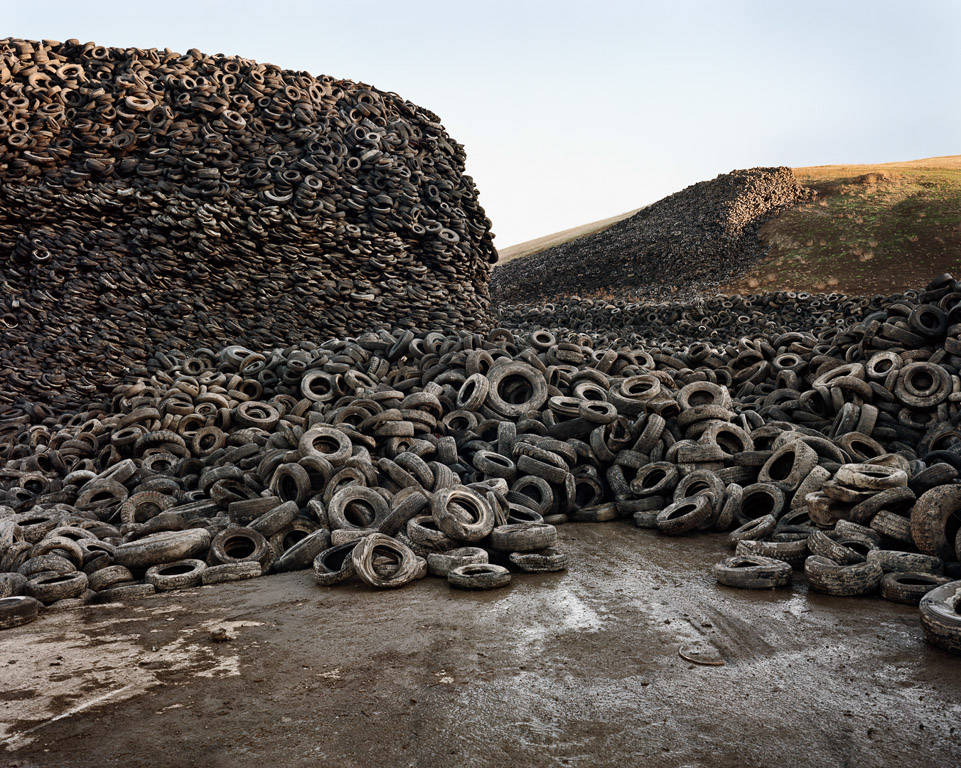

These notes are for the Energy, Technology, and Society class at Sonoma State University.

# Learning Objectives

If you are taking this class, I'll admit to you that I only have one true learning objective for this and every class I teach.
That objective is for you to discover your intellectual power and cultivate it over your lifetime.
That said, I'm glad that we get to explore the intersection of our energy system with human society and the natural environment in the process.
In this class I will ask you to leave your comfort zone and challenge yourself.

# Energy Decisions

The overarching question as we study our energy system is whether or not the energy system that supports our current way of life is threatening our way of life.
Additionally, the harms our energy system inflicts disproportionately fall on economically disadvantaged communities as well as marginalized racial groups.
That is our current energy system is at odds with our ideas of a just and healthy system.

The question for human society, is what actions should we be taking to create an energy system that promotes health and happiness for all of humanity.

We have known for over a century that our introduction of carbon dioxide into the atmosphere increases the amount of heat energy that is trapped.
This will in turn cause our global climate system to change.
We cannot predict with total certainty the implications of this change in the climate, but a cautious society would try to lessen the rate and size of the change.

This class will be about understanding each of the pieces of this overall puzzle.
You will learn to apply the fundamental scientific concepts that relate to the use of our natural resources to create energy and services that humans desire.
You will learn how our current energy system works and what a future energy system might look like.
You'll learn the extent to which we understand human behaviors that influence the use of energy.

# Skills

Many classes follow very tidy linear paths where we build up subject after subject.
The energy system is far too vast and complex to allow this in my opinion.
You will be exposed to many ideas at once and will spend much of the semester integrating and connecting the pieces.
That said, I have the following lists of skills you will acquire.

1. Back of the envelope energy estimations
1. Unit conversion
1. Scientific notation
1. Explanation of quantitative methods
1. Estimate carbon emissions from energy use
1. Articulate technical barriers to low carbon energy
1. Articulate social barriers to low carbon energy

