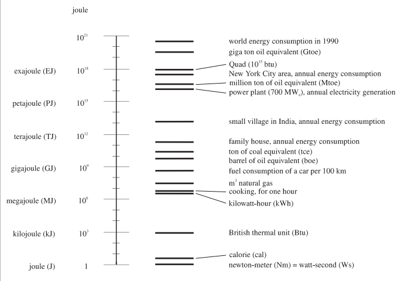

# Calculators

# Spreadsheets and Scripts

# Transparency of Intention

# Reproducibility

# Calculation Fundamentals

Note: this is a condensed version of the material in ENSP-202.
You can find the full notes of that class
[here](https://dsoto.gitbooks.io/ensp-202-notes/content/).

In order to make quantitative estimates of our energy needs and impacts,
we must extend our mathematics with new tools and techniques.

- scientific notation
- units and physical quantities
- computational tools for documenting calculations

<!-- get stuff from 202 -->

<!-- look at toolkits for examples
come up with exercises for the class
that will be turned in at the end
-->

## Learning Objectives
- You will learn to use quantitative tools to express energy
- Use spreadsheet tools to create calculations
- Use scripting languages to create calculations
- Use scientific notation to represent large and small quantities
- Use units to represent physical quantities in calculations

## Guiding Questions
- How do we create reliable, convincing estimations?
- How do we express very large and very small numbers?
- How can we make estimates with very little information?

## Readings

# Factor-Label Method

We will use a method that may be familiar to you from chemistry classes.

# Calculators

It is worth your time to download a scientific calculator for your phone.
A scientific calculator will provide useful features like

- A history of your previous computations
- The ability to see your entire mathematical expression before execution.

Having these available makes it much easier to avoid and fix computational errors.

Many students have all the concepts and skills for calculations and then become very frustrated when they make errors on their calculators.

# Scientific Notation

## Scientific Notation
- Allows us to compactly write very large or very small numbers

## A very large number
- Avogadro's Number
- $$6.02 \times 10^{23}$$
- $$10^{1}$$ = 10
- $$10^{2} = 10 \times 10$$
- $$10^{3} = 10 \times 10 \times 10$$

## A very small number
- Gravitational Constant
- $$6.67 \times 10^{-11} (m^3 kg^{-1} s^{-2})$$
- $$10^{-1} = \frac{1}{10}$$
- $$10^{-2} = \frac{1}{10 \times 10}$$
- $$10^{-3} = \frac{1}{10 \times 10 \times 10}$$

<!--
http://cshsyear10maths.global2.vic.edu.au/files/2008/08/standard-form-table.png
-->

<!-- name some common units using these prefixes -->

## Operations
- Addition
- Subtraction
- Multiplication
- Division

# Energy Quantities

## Scale of energy quantities

- from IPCC Energy Primer

## Energy Units
- Joule
    - SI Unit.  One Newton-Meter.
- Kilowatt-Hour
    - Energy consumed by 1 kW load over one hour
- Calorie
    - Energy to heat one gram of water one degree Celsius
- Kilo-calorie
    - One thousand calories.  Used in food energy content.
- British Thermal Unit (BTU)
    - Energy to heat one pound of water by one degree Fahrenheit
- Quad
    - One quadrillion ($10^{15}$) BTU

## Unit Conversions
- We may wish to compare energy units that are not consistent
- Often you can look up conversions in a table
- Other times you may need to recreate the conversion

## Back of the Envelope Calculations
- Construct a model of appropriate complexity
- Gather estimates of necessary quantities
- Calculate estimate
- Evaluate for feasibility

## Exercise
- Estimate the yearly use of gasoline in the US
- What is our strategy?

## Exercise
- How many gallons do you consume?
- How many persons in the US?

# Performing computations

While we want to develop our intuition when we are estimating with large
numbers, performing accurate calculations is also important.  You will
be able to calculate these numbers on a hand-held calculator, in Excel,
and using scientific computing platforms like Python or Julia.

Since our calculations are often used as evidence to support an
argument, they must be easy to read and have clear methods and
assumptions.  Using a computer to preserve the details of the
calculation is often preferable to using a calculator.

## Existing Knowledge

- Where have you learned how to use a calculator?
- Have you learned how to use a spreadsheet?

## Basic computations

- Addition (+)
- Subtraction (-)
- Multiplication (*)
- Division (/)
- Exponentiation (^ or **)

To perform basic calculations with numbers, we can type numbers into the
computer and use the symbols above to perform the calculation.

## Variables

To make the details of a computation more clear, we can use readable
names for our numbers and then use the names in the calculation.

    power = 100
    time = 30
    energy = power * time

This makes the intention of the calculation more clear to the reader.

## Scientific Notation

$$6 \cdot 10^3$$ is entered as ``6E3``.

## Units

Computation of physical quantities often relies on the human to define
and use a consistent set of units of measurement.  There are tools that
allow us to add physical quantities to our calculations, but they are
not as rich as I could like them to be.  One good practice is to
explicitly include the unit name in the variable name.

    power_watt = 100
    time_sec = 30
    energy_joule = power_watt * time_sec

<!-- excel has custom formats for units? -->

## Functions

A custom function can be created and used.  The syntax for this often
varies but the idea is usually the same.

    m = 1
    b = 10
    f(x) = m * x + b
    f(5) => 15

## Scientific Notation

$$6 \cdot 10^3$$ is entered as ``6E3``.

## Units

Computation of physical quantities often relies on the human to define
and use a consistent set of units of measurement.  There are tools that
allow us to add physical quantities to our calculations, but they are
not as rich as I could like them to be.  One good practice is to
explicitly include the unit name in the variable name.

    power_watt = 100
    time_sec = 30
    energy_joule = power_watt * time_sec

<!-- excel has custom formats for units? -->

## Units

Some programs can treat quantities with units.  Calca allows you to do
this.

    distance = 100 meter
    time = 12 second
    distance / time => 8.3333 meter/second

## Linear Growth

- Linear functions have the same absolute increase for equal time

## Exponential Growth and Decay

- Exponential functions have same relative increase for equal time
- What number do we multiply by itself N times to get another number?

## Activity

If a population on 1 million people is growing at 5% each year, how
large will the population be in

- 1 year?
- 2 years?
- 10 years?

# Quantities

## Dimensions, units, quantities
- A quantity represents a physical measurement like mass, length or
    amount of energy
- We represent a quantity with a number and a unit
- The dimension of a quantity is different than the unit
- For example 1 inch is the same as 2.54 centimeters even though 1 and
    2.54 are not the same number

## Physical Quantities
- Our numbers are often helping us represent physical quantities
- Examples:
    - The length of a tree
    - The number of animals observed
    - The number of molecules of mercury in a fish
- A physical quantity is expressed as the product of a unit and a
  numerical factor

## Dimensions
- These physical quantities often have a dimension
- Examples:
    - Length
    - Time
    - Mass

<!-- physics have 7 primary dimensions, we may have others -->

## Units
- To quantify dimensions, we use units
- One dimension may have multiple units
- Length: inches, miles, kilometers, light-years
- Mass: grams, pounds, kilograms
- There are also systems of units like SI or English

<!-- what are some units and some unusual units -->
<!-- clicks, bytes, click velocity -->

## Measurement
- Each measurement we make is an estimation of the physical quantity

## Consequences
- NASA Mars Climate Orbiter destroyed because of newton vs pounds of
force
- A cargo flight was lost in 1999 when crew confused meters and feet

## Unit conversion factors
- These factors are equivalent to one or unity and are dimensionless
- They are not numerically equal to one in most cases.
- Units can be crossed out

## Written
- Explanation of unit factor with inches and centimeters

## Combinations of units
- We often combine units to express new quantities

<!-- can you think of a derived unit? -->

