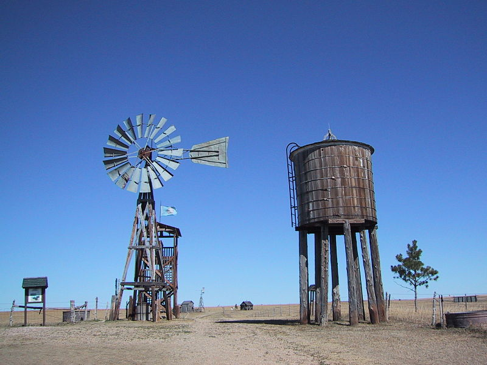
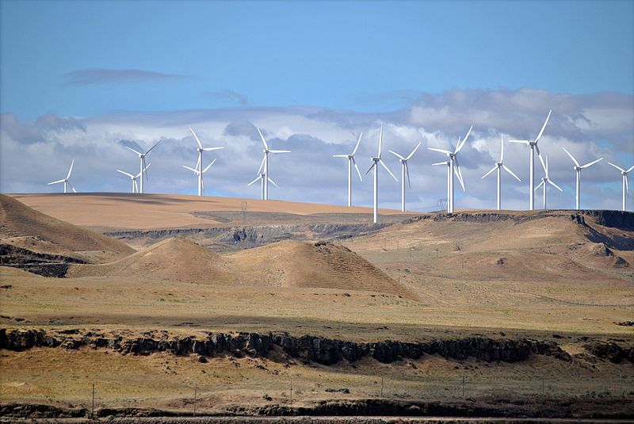

# An Energy History

## Learning Objectives

- Understand energy as an organizing principle in human history

# Energy in Antiquity

## Energy in Antiquity

- For much of human history, we used renewable sources of energy

## Biological Energy Conversion
- Plants convert radiant energy into chemical energy
- Humans convert chemical energy into human activity

<!-- - We essentially burn food in our bodies -->
<!-- - since all fossil fuel comes from plants, it is essentially solar -->

## Food Gathering Techniques
- Foraging
- Hunting
- Agriculture
- Livestock
- Which of these is our current energy system most like?

<!--
- how can you see each of these in terms of energy?
- can we think of energy impacts of our modern food system?
-->

## Fire
- Stored chemical energy in wood to heat
- Allowed for tool making
- Allowed for cooking

<!--
- Richard Wrangham, primatologist argues that:
- cooking saves energy in digestion
-->

## Fire Sources
- Wood, biomass, dung
- Coal
- Coke
- Oil
- Gas

## Amplifying human power and energy
- Ancient machines
    - Lever
    - Spring

## Hunting Machines
- Bow and arrow
    - energy is stored in bow and released quickly
- Spear and Lever
    - Lever allows hunter to impart more kinetic energy to the spear
      than with the arm alone
- Guns
    - Chemical energy converted to kinetic energy in bullet

<!--
- this advantage lead to higher energy input in human diets
-->

## Human Thermoregulation
- Our superior ability to remove heat energy from our bodies allows us
  to outrun prey animals

## Livestock
- Oxen
- Horses
- Allowed humans to cultivate more land, but required more land for food

## Water power
- Water wheels
    - converts kinetic and potential energy in water to rotational
      motion
    - estimated 500,000 waterwheels in Europe

## Water Wheel

## Wind power
- Windmills
    - converts kinetic energy in the wind to rotational motion
    - Dates to Ancient Greece
    - 12th century in Europe
    - estimated 200,000 windmills at peak in Europe
    - estimated 600,000 windmill waterpumps at peak in 1930 in United States
- Sailing
    - Allowed long distance travel

<!--
- transatlantic voyages made possible by windpower
- these first energy sources were renewable
- population in 1930 was about 122 million so about 200 persons per
  windmill
-->

## Ancient Windmill

## American Pumping Windmill

## Modern Electric Windmill

# Industrial Revolution

## Energy in the Fossil Fuel Era

- The modern era is marked by the enormous productivity gains provided
    by fossil fuel energy
- We can purchase the equivalent of one person's labor for a day for about 10 cents

## Steam Engine
- Invented by James Watt in approximately 1770
- Converts of chemical energy to heat to motion
- Created shift in manufacturing technology

## Internal Combustion Engine
- Inventions in the 1800s lead to first automobile patent by Karl Benz
  in 1886

## Electrification

- Pearl Street Station
- Steam-powered, coal-fired electricity generator
- Fossil fuel is still widely used for electricity generation

## Discussion

- Choose on of these technologies and discuss
    - Positive effects
    - Negative effects

# Consequences of Fossil Fuel Use

## Global Warming
- Widespread use of these fuels causes an increase in fossil carbon in
  the atmosphere
- Arhennius in 1896 calculated how changes in the levels of CO~2~ could
  alter surface temperature

<!--
- what is beyond dispute
- what is still under debate
-->

## Nuclear Energy
- Mass converted to thermal energy
- 1950s see the first nuclear power plants

<!--
- still the same concept
- heat is used to boil water and power a turbine
-->

## Solar Energy
"I'd put my money on solar energy...I hope we don't have to wait till oil
and coal run out before we tackle that." Thomas Edison

## Solar Energy
- Photoelectric effect discovered in 1916 by Millikan
- 1950s solar photovoltaic cells used on satellites
- Today, widespread use in private and commercial generation

## Solar Adoption
- 40 years to get to 50 GW of PV capacity
- 50 GW again in the last 2.5 years

## Future Energy Technologies?
- What technical and financial innovations will allow for more low
  carbon energy solutions?

<!--
- science-fiction time! name an invention, no matter how outlandish,
  that could impact or eliminate an energy use today.
    - efficient teleportation would eliminate car trips
    - hologram teleconferencing
    - 3D printing eliminates shipping
-->

<!--
- next time, energy physics, math, estimations
-->

