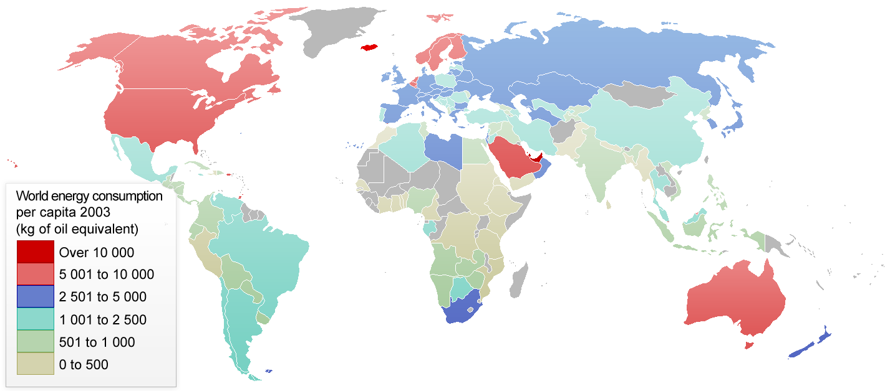
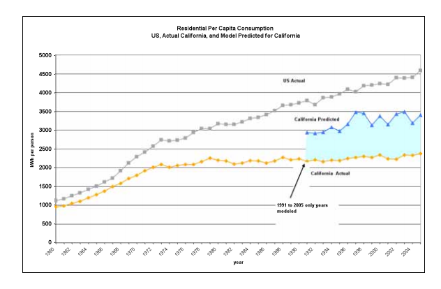
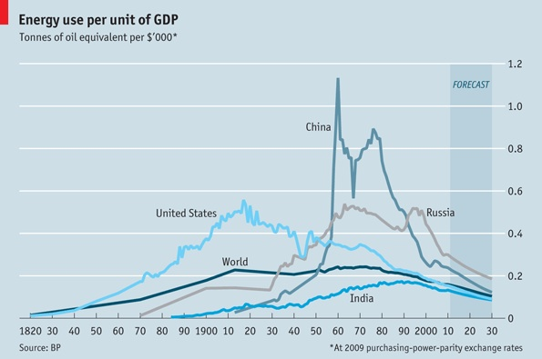
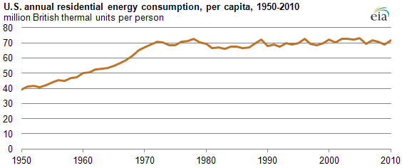

# Energy Policy

How do we make changes to our energy system?  Laws and institutions set
the rules for energy usage.

- Cap and Trade
- Carbon Tax
- Mandates
- Renewable Portfolio Standards
- Subsidy
- GDP
- Emissions per Capita

You will use your quantitative skills to assess the impact of these
different policy instruments.

## Questions

- How can we use norms and institutions to improve our energy system?
- How do we decide what a good outcome looks like?

## Learning Objectives

- Recognize important federal laws on energy
- Estimate impacts of proposed policy changes on emissions or pollution
- You will understand the links between large economies and energy use

## Definitions
- Gross Domestic Product (GDP)
    - Monetary value of all goods and services created by an economy.
- Per capita GDP (GDP per person)
    - The GDP of an economy divided by the number of persons in that economy.
- Per capita energy use (Joules per person)
- Energy intensity of GDP (Joules per GDP)

## Definitions
- Primary energy
    - Energy as it occurs naturally
- Secondary energy
    - An energy source that has been converted to a more convenient form

## Energy and GDP
[Energy vs GDP by country](http://www.withouthotair.com/c30/figure242.png)

<!-- ## Energy Intensity -->
<!--  -->

## Energy per capita

## US GDP
- 2006
- GDP 14 trillion USD $$14 \cdot 10^12$$
- Population 300 million
- Energy use 100 Quads

## California Electricity Consumption

<!-- what is the MPG of an economy? -->

## Energy per unit of GDP

<!--  -->

# US

## US primary energy use

## Annual residential energy per capita

## US electricity consumption

<!-- - let's do rough conversion to per capita -->

## Consumption growth

## State energy consumption per capita

<!-- - Why does California have high consumption but low consumption per capita? -->

## US carbon emissions

- 
- What are possible reasons for the increase over time?
- For the decrease recently?

## US primary energy consumption

## US oil consumption

<!--  -->

<!--  -->

## Solar Learning Curve

## Pacala and Socolow
- Authors demonstrate solving climate problem with existing technologies
- Hoping to settle debate on whether current technologies are sufficient
- This is clearly stated in the introduction

## Pacala and Socolow
- What carbon level do the authors want us to stay under?
- Describe a wedge in your own words
- Which of the wedges suggested is most appealing to you and why?
- This paper is ten years old now, are there any new wedges we could
  add?

# California

## California
- Global Warming Solutions Act of 2006 (AB 32)
    - Reduce GHG emissions to 1990 levels by 2020
    - 1990 was 427 million metric tonnes of CO2 equivalent

## How are we doing?

## California 2050 goal
- 80% reduction below 1990 levels

## How do we achieve this goals?
- What can we do on a county or state level?

# Sonoma County

## Sonoma County
- Sonoma County Energy Independence Program (SCEIP)
- Property Assessed Clean Energy (PACE)

## Sonoma County
- Recently announced PACE Financing Marketplace
- Allows multiple choices of funding for consumers

## Property Assessed Clean Energy (PACE)
- Allows loans to be paid back on the property tax bill
- Funded through municipal bonds
- Loan is attached to the property
- Has funded over $68 million dollars in projects

## United States
- Clean Air Act 1963
- Clean Water Act 1972
- Energy Independence and Security Act of 2007

## Sonoma County Action Plan
- [GHG Plan Highlights](http://www.coolplan.org/ccap-report/Action_Plan_HighlightsPRINT6.pdf)
- [2005 Action Plan](http://www.sonoma-county.org/gs/pdf/GHG_Action_Plan.pdf)
- [2008 Action Plan](http://www.coolplan.org/ccap-report/CCAP_Final_11-05-08.pdf)

## Sonoma County Climate Plan

## Sonoma County Climate Plan

## Sonoma State
- What policies could you imagine here at Sonoma State

## CSU Policies
- [CSU Sustainability Policy](http://www.calstate.edu/cpdc/sustainability/policies-reports/documents/JointMeeting-CPBG-ED.pdf)
- [2014 CSU Sustainability Report](http://www.calstate.edu/cpdc/sustainability/policies-reports/documents/CSUSustainabilityReport2014.pdf)
- [STARS Report Campuses](http://www.calstate.edu/cpdc/sustainability/climate-change/)

# Global Negotiations

## Rio Earth Summit, 1992
- Negotiated the United Nations Framework Convention on Climate Change
  (UNFCCC)

## Kyoto Protocol, 1997
- Adopted at the 3rd Conference of the Parties (COP 3)
- China and India not required to cut
- US did not ratify the treaty
- Burden of emissions reductions placed on developed countries

## Copenhagen Climate Change Conference, 2009
- 15th Conference of the Parties (COP 15)
- Viewed as a disappointment by many

## Paris, 2015
- 21st Conference of the Parties (COP 21)
- Goal of limiting average temperature increase to 2 degrees Celsius
  above preindustrial levels

## Montreal Protocol, 1987
- International agreement to reduce Chlorofluorocarbons (CFCs) and other
  ozone damaging chemicals
- Provides an example of a world wide emissions reduction treaty

## China US Climate Agreement
- Last week, the US and China announced a historic agreement to reduce
  GHG emissions

## Discussion
- Read the
  [article](http://www.vox.com/2014/11/11/7200909/US-china-climate-deal-cutting-emissions)
- We will then discuss some questions

## What are the basic terms of the agreement?
- For the US?
- For China?

## Are these terms meaningful?
- How do these compare to existing targets like California AB32?

## What difficulties do you anticipate?
- Why would China want to reach this deal
- Why doesn't China want to peak now?
- Why would US want this deal
- Why not?

# Examples

We want to reduce GHG emissions about 85% by 2050.  Sonoma county has a
2015 GHG emission of 3.5 units and a 2050 target of 0.5 units.  This
reduction will happen over 35 years.

$$ \delta t = 2050 - 2015 = 35 $$
$$ 0.5 = 3.5(1-r)^{35} $$
$$ (0.5/3.5)^{1/35} = 1-r $$

This works out to about a five percent per year reduction.
