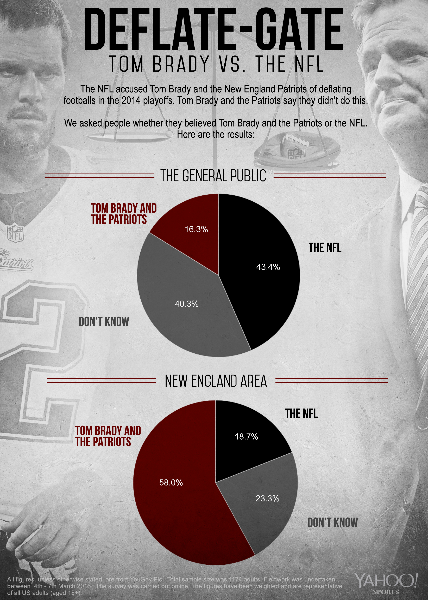

# Evidence and Belief

You might wonder why humanity hasn't made significant action towards our climate problem.
It could be that folks do not understand the science very well.
It could be that the implications of the science conflict with our values and beliefs and we disregard the science.
It could be that interested parties are deliberately publishing material meant to confuse citizens and cast doubt on scientific consensus.

## Motivated Numeracy Question

Researchers asked the questions:

- Do folks with higher degrees of scientific ability accept science more readily?
- Does our minds desire to protect our existing beliefs reduce our acceptance of new data?

- [Paper Link](https://papers.ssrn.com/sol3/papers.cfm?abstract_id=2319992)

## Motivated Numeracy Result

People with higher science and math ability were more likely to get math problems wrong when they conflicted with their beliefs.

This suggests that science education is not the key to climate change acceptance but rather understanding human psychology.

## Team-Based Epistemology

Evidence is emerging that our processing of new scientific knowledge (epistemology) is strongly influenced by our existing beliefs and our social groups (team).

## Deflategate

In the 2014 NFL playoffs evidence emerged that Tom Brady and the Patriots deflated footballs to give themselves an advantage.

The percentage of belief in the innocence of Brady and the Patriots was different for New England residents compared to the nation.

The majority opinionn of one of these two groups must be wrong.

## Polling Data

Polling shows strong differences of opinion on climate science and the honesty of scientists according to political party.

- [Pew Evironment and Politics](http://www.pewinternet.org/2016/10/04/the-politics-of-climate/)

The majority opinionn of one of these two groups must be wrong.

## Pelosi and Gingrich Video

There was recently bipartisan support in the US congress for climate change policy.
Why do you think this has changed?

[Climate Change Political Ad](https://www.youtube.com/watch?v=qi6n_-wB154)

## Implicatory Denial

If we accept that our climate is becoming more violent and that human emissions are the cause several implications emerge.

- The free market has failed and will produce an enormous economic loss
- International cooperation and collectivism will be necessary

## Doubt and Scientific Debate

- In "Merchants of Doubt", historian Naomi Oreskes catalogs how corporations engaged in campaigns to confuse the public about the science of tobacco, global warming, and other issues.

- [Trailer](https://www.youtube.com/watch?v=jmwmMUfn7IY)

## Terms

- Misinformation
    - Bad information that isn't necessarily malicious.
- Disinformation
    - Bad information with the intent to deceive.
- Lying
    - Bad information with the intent to deceive.
- Propaganda
    - Biased or misleading information used to promote a political agenda.
- Fake News
    - Originally, completely invented news stories mostly written to make a profit.

## Guarding against bias

How will you guard against misinformation when it is designed for your mind?

Remember that internet companies have a very good idea of what you believe through what you choose to read.

Evidence suggests that curiosity about scientific truths and a willingness to be wrong reduce the effects of bias and denial in human thinking.

What should you do to encourage open-mindedness and curiosity in your thinking?
What is the most deeply held belief you are willing to admit you might be wrong about?

<!-- ## Being Wrong -->
<!--  -->
<!-- Being Wrong catalogs the various types of cognitive mistakes and biases we can make.  It also asks us to see seeking out our mistakes as a virtue. -->
<!--  -->
<!-- &#45; [Book Being Wrong](http://beingwrongbook.com/) -->
<!--  -->
<!--  -->
<!--  -->
<!-- ## Curiosity and Questions -->
<!--  -->
<!-- Questions are a tool to gain a deeper understanding of issues.  The more questions you ask, the better your questions will become. -->
<!--  -->
<!-- Don't think of questions as a demonstration of your ignorance. -->
<!--  -->
<!-- Think of questions as a sign of your curiosity and intellectual power. -->
<!--  -->
<!--  -->
<!-- ## Curiosity Question -->
<!--  -->
<!-- Researchers asked -->
<!--  -->
<!-- &#45; Can scientific curiosity mitigate the biased reasoning that we observe? -->
<!--  -->
<!-- &#45; [Paper Link](http://onlinelibrary.wiley.com/doi/10.1111/pops.12396/full) -->
<!-- &#45; [Vox Research Summary](https://www.vox.com/science&#45;and&#45;health/2017/2/1/14392290/partisan&#45;bias&#45;dan&#45;kahan&#45;curiosity) -->
<!--  -->
<!-- ## Curiosity Results -->
<!--  -->
<!-- People who rated higher on a scale of scientific curiosity were more likely to search out information conflicting with their current views. -->
<!--  -->
<!-- ## What can't you see because of your team? -->
<!--  -->
<!-- Do your social and political groups keep you from accurately seeing the evidence on -->
<!--  -->
<!-- &#45; Climate change -->
<!-- &#45; Pesticides -->
<!-- &#45; Genetically modified foods -->
<!-- &#45; Tax Policy -->
<!-- &#45; Sexual Assault -->
<!-- &#45; Police Violence -->
<!-- &#45; Russia and the 2016 Election -->
<!-- &#45; Benghazi and Uranium One -->

