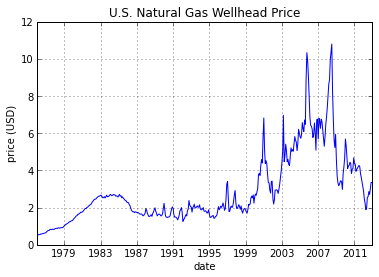

# Fossil fuels
- Fossil fuels are the product of millions of years of photosynthesis
  stored and processed under heat and pressure
- Most fuel is found in rocks from about 50-450 million years ago

<!-- ## Learning Objectives -->
<!-- &#45; You will be able to describe consequences of fossil fuel use -->
<!-- &#45; You will be able to list the major uses of coal, petroleum, and natural gas -->
<!-- &#45; You will be able to understand some of the connections between fossil fuel use and human activities -->

## Review
- Energy basics
- Estimation techniques
- Laws of thermodynamics
- Carbon, photosynthesis, and combustion

# Fossil Fuels

- where do we get them
- how do we use them
- why are they useful
- how are they harmful
- fossil fuel etymology latin fodere dig fossilis dug up

## Types of Fossil Fuels
- Coal
- Petroleum
- Natural Gas

## Impacts of a Global Fossil Fuel Network
- Fossil fuels are being extracted, processed, and used all over the world
- Who bears the burden of the consequences?
- Who benefits from their use?
- Where are these consequences located?

## Origin of Fossil Fuels

## Fossil Fuel Molecules

## Petroleum prices

Certain prices are indexed and recorded

[Bloomberg Energy](https://www.bloomberg.com/energy)

## Petroleum use

## Natural gas prices currently low

<!-- ## Natural gas use -->
<!--  -->
<!--  -->
<!-- ## Coal use -->
<!--  -->
<!--  -->
<!-- ## Primary energy use -->
<!--  -->
<!--  -->
## Pollution effects
- Carbon dioxide climate
- Particulates
- Acid rain
<!--  -->
<!--  -->
## Impacts of extraction methods
- exxon valdez 1989 prince william sound, alaska
- deepwater horizon explosion 2010
- sago mine 2006 disaster
<!--  -->
## Fossil Fuel Subsidies
- exploration expensing
- unpriced externalities
