# Nuclear Energy

## Nuclear energy
- Nuclear energy used for electricity
- Very similar to fossil fuel plants

<!--
link to other concepts
- second law of thermodynamics
- heat engine
- inital cost, recurring cost, fuel cost
- capacity factor
-->

## Electricity Flow

Nuclear energy is mainly used for electricity.

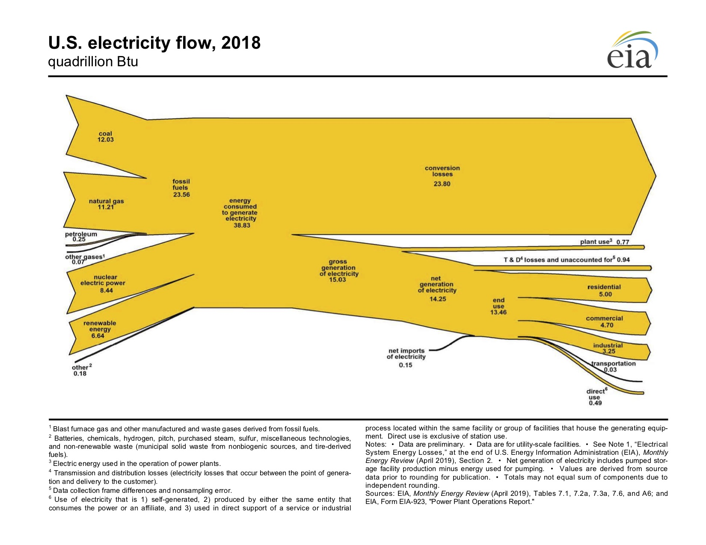

More data can be found at the [EIA](https://www.eia.gov/totalenergy/data/annual/)

## Fusion vs Fission
- Fusion joins atomic nuclei
- Sun is a fusion reaction
- Fission splits atomic nuclei
- Nuclear energy is a fission reaction

## Fission
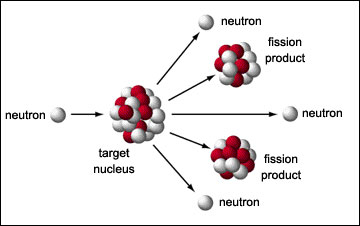

## Electronic vs Nuclear Energy Levels
- Mass Energy Equivalence
- $E = mc^2$
- The very high binding energy in the nucleus allows for small amounts
  of fuel to release large amounts of energy
- 3 million times more electricity per kg than coal

## Nuclear Decay
- Elements become other elements (the goal of alchemists)
- Iron most stable

## Nuclear Fuel

## Uranium Metal
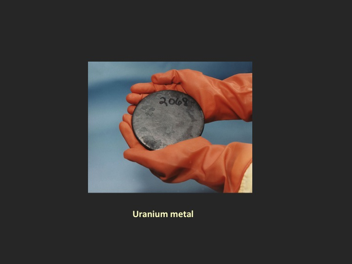

## Uranium Mine
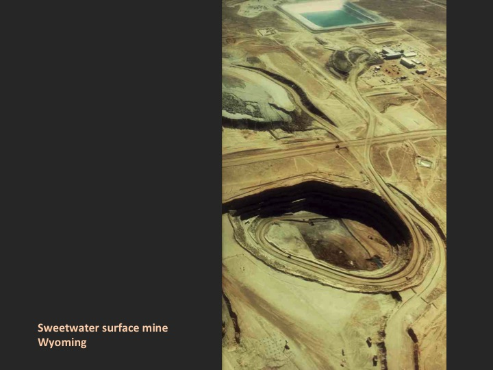

## Uranium Ore
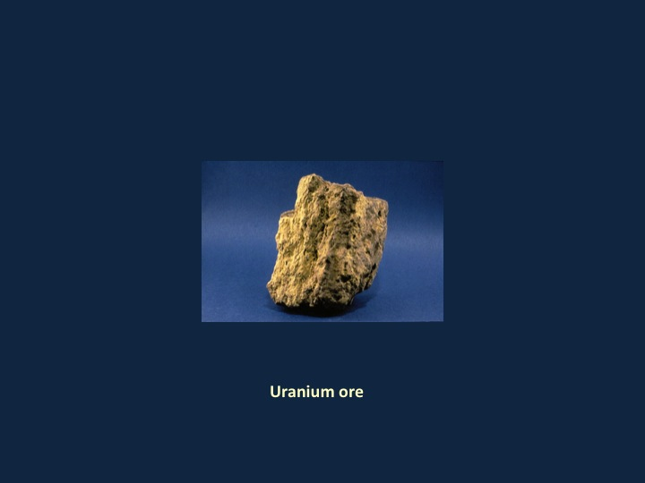

## Uranium Yellowcake
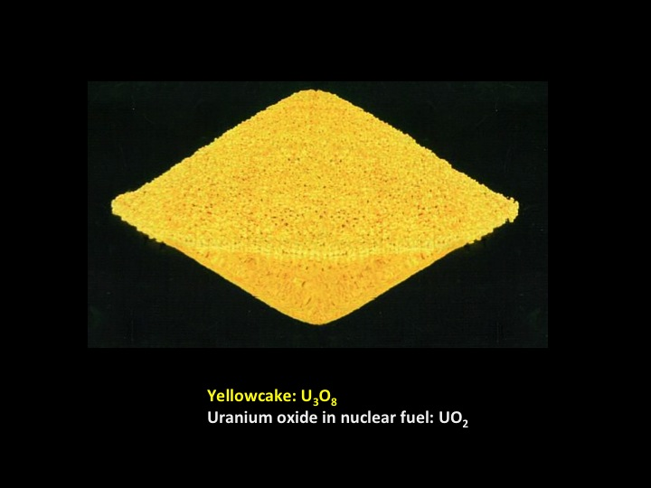

## Nuclear Fuel Rods
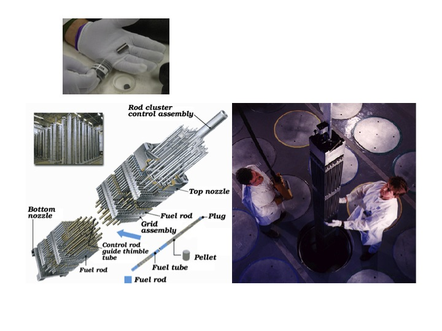

## Nuclear Reactor Core
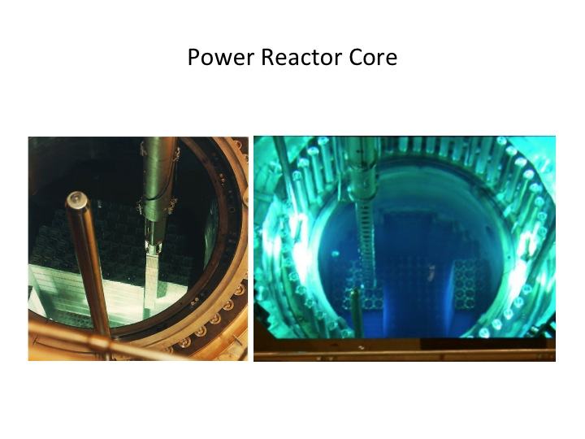

## Nuclear Reactor Diagram
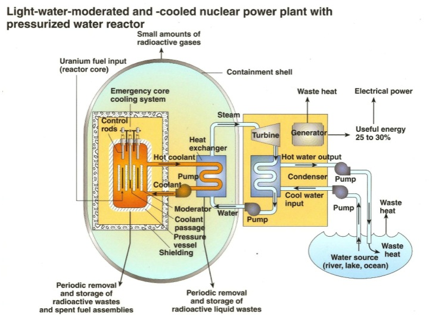

## Nuclear Waste Disposal

## Half Life
- Definition
- Relation to carbon dating
- Relevance to end of life
- Plutonium 239 half life of 2400 years

## Half Life
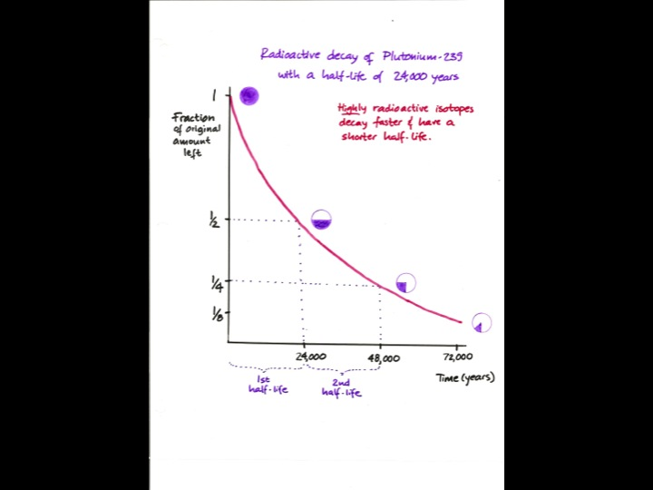

## Water Fuel Storage
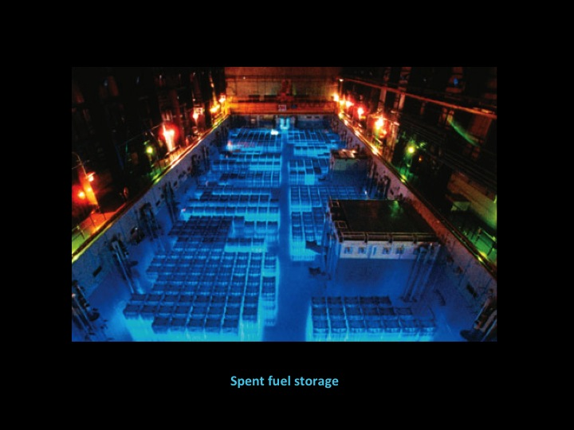

## Above Ground Fuel Storage
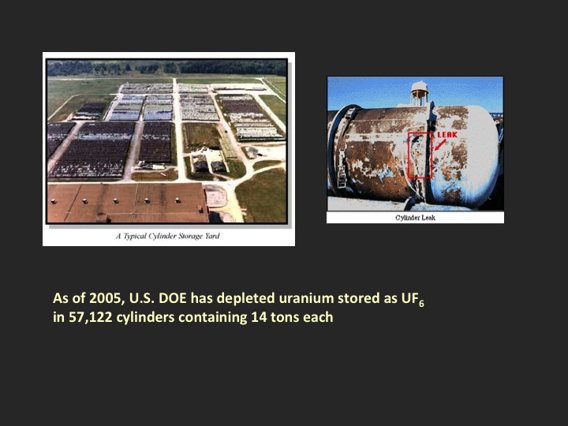

## Electricity Death Rates

$$ \textrm{Death Rate} = \frac
   {\textrm{Number of Deaths}}
   {\textrm{Electrical Energy Delivered}} $$

## Electricity Death Rates

| Source  | Deaths per TWh|
|---------|---------------|
| Coal    | 161           |
| Solar   | 0.44          |
| Nuclear | 0.04          |

Source: nextbigfuture.com based on WHO data

## Nuclear energy
- Over 430 nuclear reactors
- 370 GW of capacity
- 70 reactors under construction
- About 10% of world electricity production

<!-- world electricity capacity EIA 5,331 Million KW -->
<!-- 5 10^12 W = 5 TW -->
<!-- global power demand 16 TW  -->

<!-- good stuff in wikipedia world energy consumption -->

## Nuclear Electricity Production
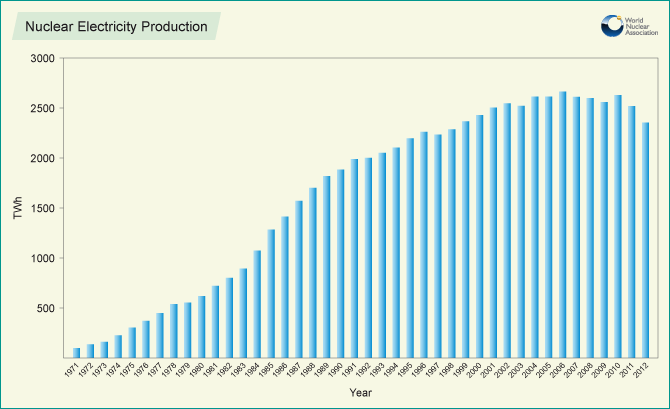

## Nuclear Installed Capacity
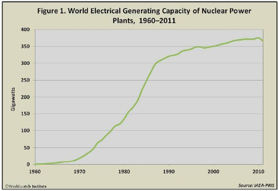

## Capacity vs Delivered Electricity
- US Nuclear Capacity
- US Nuclear Energy Production

## Lifetime cost of nuclear electricity
- Cost is seen as a key weakness for nuclear electricity
- Plant construction
- Fixed operation and maintenance
- Variable operation and maintenance
- Decommissioning cost
- Waste disposal

## Lifetime cost of nuclear electricity
- cost of construction 83.4 USD/MWh
- fixed operation and maintenance 11.6 USD/MWh
- variable operation and maintenance (fuel) 12.3 USD/MWh
- total 108.4 USD/MWh
- compare to coal (65.7, 4.1, 29.2, 100.1)
- compare to natural gas (17.4, 2.0, 45.0, 67.1)

<!-- ## Discussion -->
<!-- &#45; Nuclear power risks and benefits -->
<!--  -->
<!-- ## Patrick Moore Testimony -->
<!-- &#45; What is Moore arguing? -->
<!-- &#45; What parts of his argument do you find compelling? -->
<!-- &#45; What parts of his argument do you find lacking? -->
<!-- &#45; What are the reasons for his conclusion? -->

<!--
evidence
unfair comparisons
value conflicts
- how would you investigate his reasons for yourself?
- what would it take to scale up?
-->

