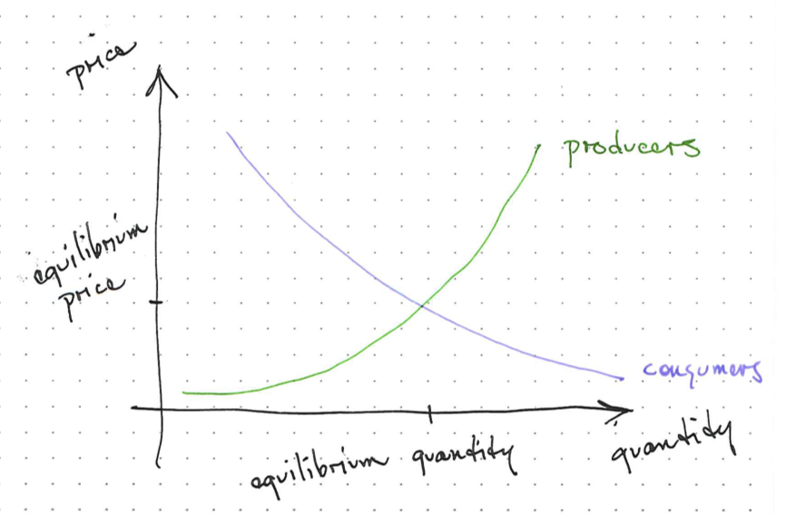
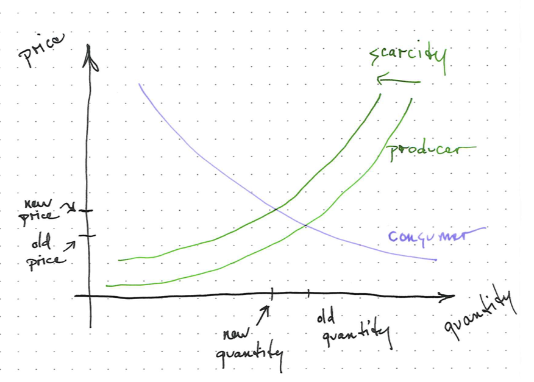

# Social Science Fundamentals

There is lots of emphasis on the physical aspects of energy use but human decisions dictate the usage of energy.
Therefore, it is important to understand social science concepts.

What patterns in human behavior can be predicted that influence our energy use and consequences?

<!-- ## Learning Objectives -->
<!-- &#45; Recognize and identify key concepts from social science that influence -->
<!--   energy use in society -->
<!--  -->
<!-- ## Readings -->
<!-- &#45; Robbins -->
<!-- &#45; NC&#45;14 Human Capitalism? -->
<!--  -->
<!--  -->
<!-- ## Learning Objectives -->
<!--  -->
<!-- &#45; Understand economic drivers of energy consumption -->
<!-- &#45; What is the energy efficiency of a society? -->
<!--  -->
<!-- ## Reading -->
<!--  -->
<!-- &#45; E&#38;S Chapter 3 -->
<!-- &#45; E&#38;S Chapter 4 -->
<!-- &#45; Hardin, The Tragedy of the Commons -->
<!-- &#45; Coase, The Problem of Social Cost -->
<!--  -->

## Concepts

Some important concepts for us to study are:

- Market
- Market Response Model
- Supply and Demand
- Externalities
- Subsidy
- Commons
- Prisoner's Dilemma

## Market

- A system that allows for multiple parties to participate in exchange
- We have several energy markets
- The free market rests on several assumptions that are not true in practice

For all their power and vitality, markets are only tools.
They make a good servant but a bad master and a worse religion.
- Amory Lovins, Natural Capitalism

## Market Response Model

Predicts that scarcity raises prices resulting in decreased demand or increased supply

- Improved techniques can lower prices and increase supply
- Natural Gas Hydraulic Fracturing is an example

## Supply and Demand

## Externality

A cost or benefit borne by everyone from one person's decision

## Coase Theorem

The Coase Theorem states that externalities can be most efficiently controlled by agreements between parties.

The main problem facing our climate--energy system has too many parties for the Coase Theorem to be true.

## Subsidy and Taxes

If we want to change the amount of a good or service that is provided, we must change the intersection of the supply and the demand curves.

We do this by lowering or raising the price of a good.

For example, if the government creates a carbon tax, the price of gasoline will rise, and there will be less gasoline sold and less carbon emitted.

If instead we want more electric cars, the government can provide a subsidy to electric cars that lowers the price and the market will produce more cars.

## Commons

- Difficult to enclose
- Available to all
- Prone to defection or free-riders

- A resource accessible to all members of a society and not owned privately

## Free riders

- Individuals who gain a benefit from a system without contributing
- These are the folks that choose individual benefit over group cost

## Prisoner's Dilemma

The classic prisoners dilemma is two criminals.

|              | Walter Silent    | Walter Rats      |
| -            | -                | -                |
| Jesse Silent | Walter and Jesse | Walter free,     |
|              | do 6 months      | Jesse 10 years   |
| Jesse Rats   | Jesse free,      | Walter and Jesse |
|              | Walter 10 years  | 10 years         |

We can use the Prisoner's Dilemma to think about emissions and other
externalities by companies.

|             | VW reduces emissions | VW cheats           |
| -           | -                    | -                   |
| BMW reduces | Emissions reduced,   | BMW at competitive  |
| emissions   | no disadvantage      | disadvantage        |
| BMW cheats  | VW at a competitive  | Emissions increased |
|             | disadvantage         | for everyone        |

- Now imagine the decisions of all companies in the world or all citizens
- Each of us can decide to do the best collective action or the best individual action
- Unfortunately, the best individual option can be a very bad collective outcome

## Tragedy of the Commons

This is an influential theory but there are several counter-examples to its main claims.

- Garrett Hardin article 1968
- Proposed regulation or privatization as only solutions
- Elinor Ostrom recognized several functioning commons that didn't fit this model
