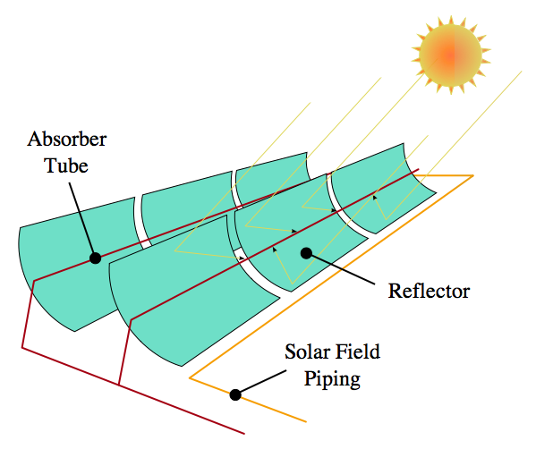

# Solar Energy

## Types of solar energy
- Solar Thermal
    - Radiant energy to heat
    - Very similar to a coal electricity plant
- Solar Photovoltaic
    - Radiant energy directly to electricity using semiconductor technology
    - Solar can be scaled from large to small amounts of generation

## The journey of a photon

- Created in the core of the sun by nuclear fusion reaction
- Millions of years to bounce out to surface of sun
- Zips to earth in about 8 minutes
- Passes through the atmosphere
- Strikes a solar panel and dislodges an electron in the PV panel
- Electron is collected and delivered to the grid

# Solar radiation
- Conversion of mass energy to radiation
- Converts hydrogen to helium

## Solar radiation
- [Solar
  Reaction](http://m.teachastronomy.com/astropedia/article/Nuclear-Reactions-in-Main-Sequence-Stars)

## Solar energy
- Peak solar power about 1000 watts per square meter
- Solar power is usually measured for this level of sunlight
- However, sun is not always this bright
- Our sunniest locations get about 5.5 kWh per square meter per day of sun energy

## Electromagnetic Spectrum

## Blackbody Spectrum

## Solar Photovoltaic

- Converts sunlight directly to electricity
- Commercially available panels have 15% -- 20% efficiency of solar
  energy in to electrical energy out

# Photovoltaic electricity plants

## Agua Caliente
- Highest power photovoltaic power facility in 2013
- Yuma, Arizona
- 397 MW peak production
- 25 year power purchase agreement

## Agua Caliente Data
[Agua Caliente Monthly Production Data](http://www.eia.gov/electricity/data/browser/#/plant/57373)

<!--
how many have burned ants with a magnifying glass?
-->

# Solar thermal plants

## Parabola

A parabola is the shape that reflects parallel lines to a point.
Since the sun's rays are essentially parallel, this focuses the sun to a point.

## Concentrating solar power trough

We heat oil along large parabolic mirrors.

## SEGS
- Solar Energy Generating Systems
- First solar thermal plants
- Daggett, CA
- Built in 1984 and 1985

<!--
solar mineral oil tank explosion
in february 1999
-->

## Ivanpah
- 377 MW
- Concentrating solar thermal power towers
- Near Las Vegas, Nevada
- No thermal storage
- Natural gas backup

## Ivanpah solar plant

## Solar power tower

## Solar Thermal

### Advantages
- Uses well established thermal electricity technology

### Disadvantages
- Needs water, scarce in sunny climates

## Developing world solar
- Phone charging
- Water pumping
- Lighting

## Solar Lantern

<!-- ## Solar Microgrid Uganda -->
<!--  -->

<!-- ## Solar Microgrid Uganda -->
<!--  -->
<!--  -->
<!-- ## Uganda CFL lighting -->
<!--  -->
<!--  -->
<!-- ## Uganda CFL lighting -->
<!--  -->

<!-- ## Solar concentration -->
<!--  -->
<!--  -->
<!-- ## Solar water heater -->
<!--  -->
<!--  -->
<!-- ## Parabolic Concentrator -->
<!--  -->
<!--  -->
<!-- ## Parabolic Concentrator Thermal Storage -->
<!--  -->
<!--  -->
<!-- ## Parabolic Concentrator -->
<!--  -->
<!--  -->
<!-- ## Rural solar panel -->
<!--  -->
<!--  -->
<!-- ## Solar photovoltaic water pumping -->
<!--  -->

<!-- # Global Solar Energy -->

<!-- ## Global solar resource -->
<!--  -->

## Solar Installed Capacity

## What scale is needed?

- World primary energy consumption approximately 500 EJ
- Power = Energy / Time
- Joules / seconds = Watts
$$ P = 500 EJ / 3.15 \cdot 10^{7}\ seconds = 16 TW $$

## Photovoltaic learning curve

## Solar Energy
- Approximately 1000 watts per square meter on the surface of the earth
  at peak
- 170 watts per square meter average insolation

<!-- ## Solar Spectrum -->
<!-- [Solar -->
<!-- Spectrum](http://upload.wikimedia.org/wikipedia/commons/4/4c/Solar_Spectrum.png) -->
<!--  -->
<!--  -->
<!-- ## Solar Energy Budget -->
<!-- [Solar Energy Budget -->
<!-- (nasa.gov)](http://science&#45;edu.larc.nasa.gov/EDDOCS/images/Erb/components2.gif) -->
<!--  -->
<!--  -->
<!-- ## Solar radiation -->
<!-- &#45; Solar radiation drives many processes on Earth -->
<!-- &#45; Wind -->
<!-- &#45; Waves -->
<!-- &#45; Ocean Currents -->
<!-- &#45; Atmospheric Currents -->
<!--  -->
<!-- ## Water evaporation -->
<!-- &#45; Latent heat absorbed during evaporation of water -->
<!-- &#45; Latent heat released during rain -->
<!--  -->

